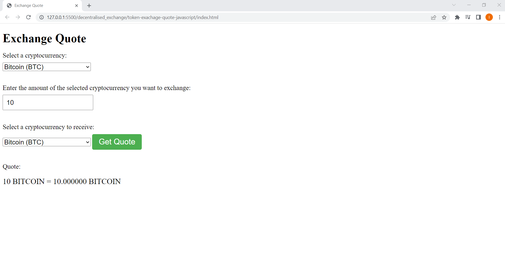

# Exchange Quote Web Application



This web application fetches the top 10 cryptocurrencies by market capitalization from the CoinGecko API and allows users to get a quote for exchanging one cryptocurrency for another based on the current market prices.

## How to use

1. ```
   https://github.com/Ab-verse/token-exchange-quote-web-app.git
   ```
2. open the HTML file in a web browser.
3. Visit the web application in a web browser.
4. Select the cryptocurrency you want to exchange from the first dropdown menu.
5. Enter the amount of the selected cryptocurrency you want to exchange in the input field.
6. Select the cryptocurrency you want to receive in the second dropdown menu.
7. Click the `Get Quote` button to see the current exchange rate and quote for the selected transaction.

## Technologies Used

The web application uses HTML, CSS, JavaScript, and the Axios library to interact with the CoinGecko API.

## Installation

No installation is necessary. Simply open the HTML file in a web browser to use the application. However, an internet connection is required to fetch the data from the CoinGecko API.

# Thank You!

[](https://twitter.com/Abverse_)
[](https://www.linkedin.com/in/abhishek-s-ckm)
